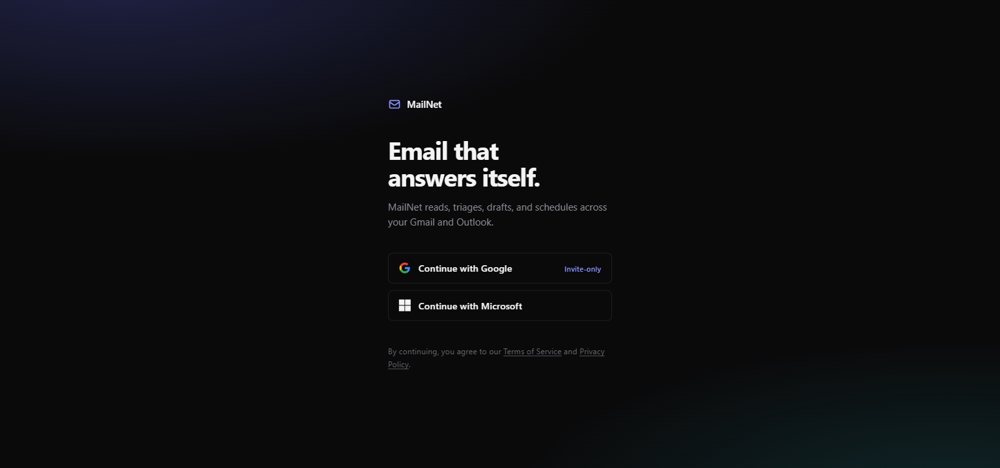
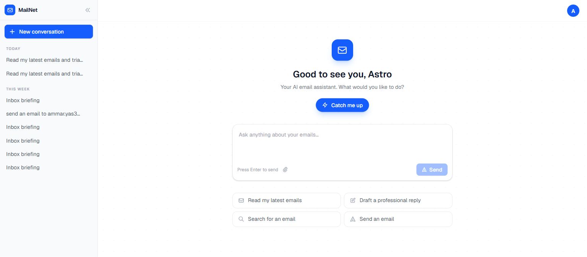
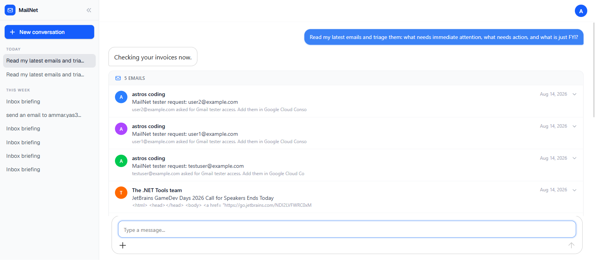
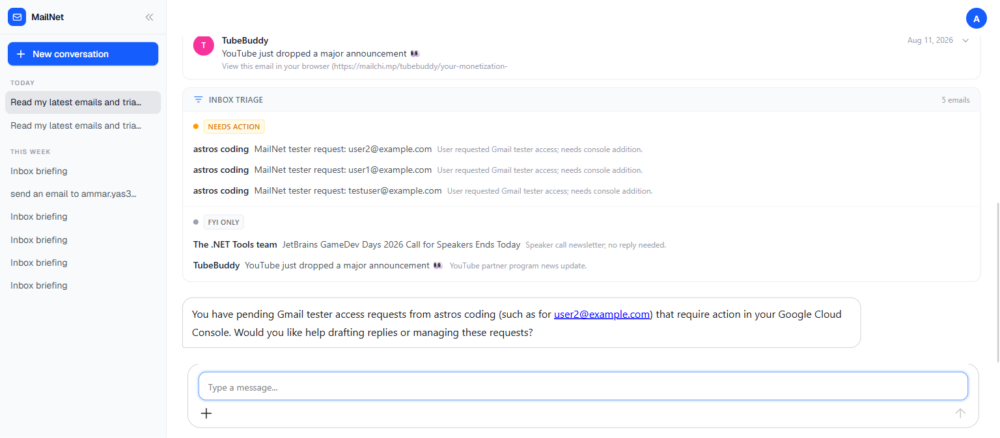
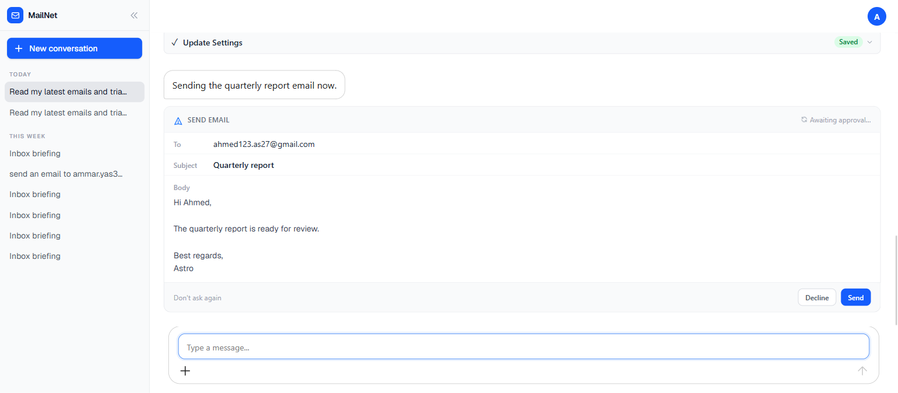
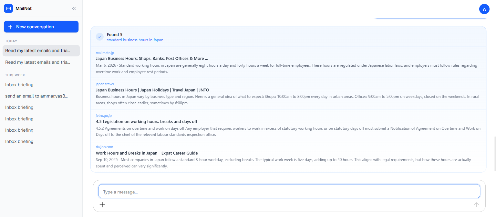
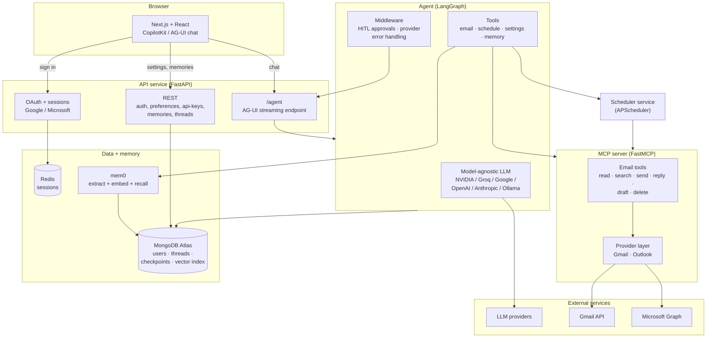
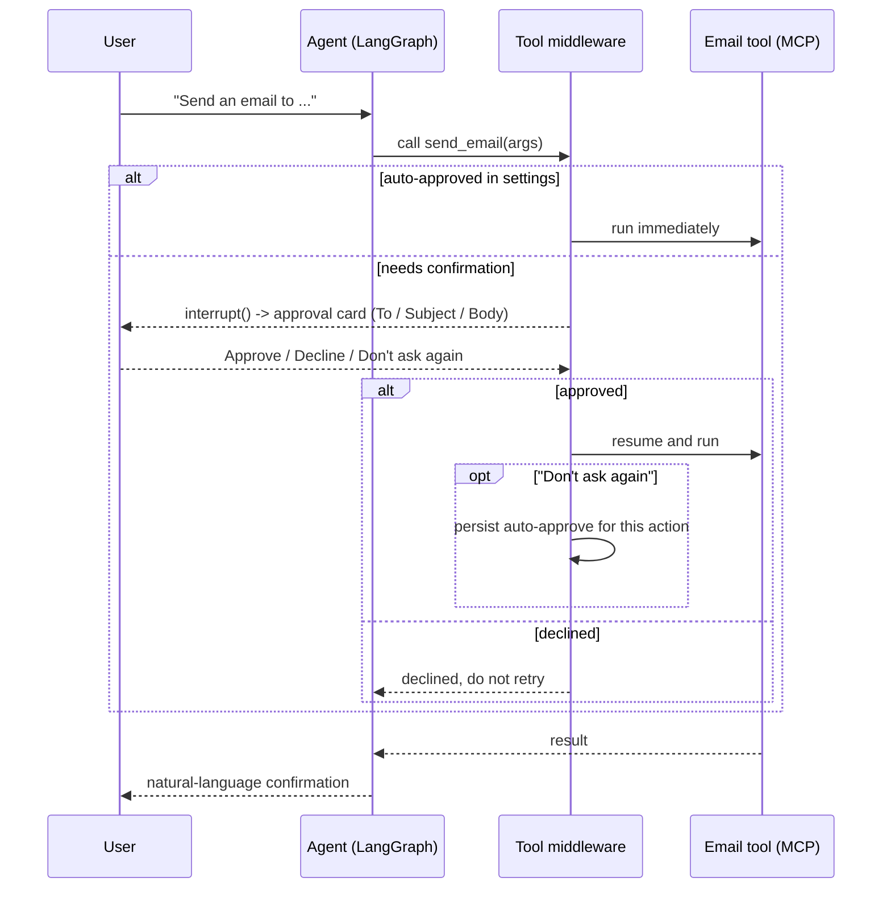

# MailNet

**An agentic email assistant that reads, writes, schedules, and manages your inbox through natural conversation, across Gmail and Outlook, with a model you choose.**

**Live at [getmailnet.com](https://getmailnet.com).** Microsoft sign-in is open to everyone; Gmail is invite-only while the app goes through Google's verification (request access from the login page).

MailNet is a conversational agent built on LangGraph and the Model Context Protocol (MCP). You talk to it; it uses tools to act on your real mailbox. It remembers what matters about you, asks before doing anything destructive, and runs on whichever LLM you point it at, including a free shared key so it works the moment you sign in.

> This is a portfolio project demonstrating agent architecture. See [Status](#status).

---

## Highlights

- **Conversational email actions.** Read, search, compose, reply, draft, send, and delete across **Gmail and Outlook** through one interface. Provider differences are hidden behind an MCP server.
- **Bring your own key, model-agnostic.** Chat runs on **NVIDIA (NIM), Groq, Google (Gemini), OpenAI, Anthropic, or Ollama Cloud**. Pick a provider, the model list is fetched live, and your key is validated before it is saved. No key? The app falls back to a shared developer key chain (NVIDIA first, then Groq, then Gemini) so it works out of the box.
- **Semantic memory.** Durable facts about you (recurring contacts, tone, habits) are extracted, embedded, and stored in MongoDB Atlas Vector Search via [mem0](https://github.com/mem0ai/mem0), then recalled to personalize replies. Memories are fully manageable from the UI.
- **Human in the loop.** Sending, replying, and deleting pause for an inline approval card. Trust an action once with "Don't ask again," or manage auto-approvals in settings.
- **Scheduling.** One-off and recurring sends handled by a dedicated APScheduler service.
- **Secure by construction.** OAuth for both providers, per-user sessions, encrypted tokens and BYOK keys at rest (Fernet), per-user data isolation, and rate limiting.
- **Zero marginal cost.** The default stack runs entirely on free tiers (NVIDIA NIM, Groq, Gemini, MongoDB Atlas, Redis), gated behind real OAuth.
- **Inbox intelligence.** A proactive "Catch me up" briefing that opens with the most urgent email, a triage card that classifies the inbox (needs action / FYI), and a live web-search card for questions that need the internet.
- **Verifiable claims.** Terms and Privacy pages link to the exact source lines that encrypt tokens and keys; a Contribute tab in Settings points anyone at the code.

---

## Screenshots

**Sign in** – flat, single-statement login. Gmail shows its invite-only state up front; a dialog explains Google's verification process and lets visitors request tester access.



**Home** – the assistant greets you and offers a proactive inbox briefing.



**Reading the inbox** – emails render as a card, not a wall of text.



**Triage** – one request classifies the inbox into needs-action and FYI with a reason per email.



**Human-in-the-loop approval** – sending pauses on an approval card with the full draft; nothing leaves without your click (unless you opt into auto-approve).



**Web search** – when a question needs the internet, results stream into a source card.



---

## Architecture



### Components

| Service | Stack | Responsibility |
|---|---|---|
| **frontend** | Next.js 16, React 19, Tailwind 4, CopilotKit / AG-UI | Chat UI, streaming responses, tool-call cards, settings, memory management |
| **api** | FastAPI, LangGraph, langchain | Hosts the agent, streams AG-UI events, handles OAuth, sessions, and all REST endpoints |
| **mcp** | FastMCP | Exposes email actions as tools; hides Gmail vs Outlook behind one provider interface |
| **scheduler** | APScheduler | Executes one-off and recurring scheduled sends |
| **redis** | Redis | Server-side session store |
| **MongoDB Atlas** | (managed) | Users, threads, LangGraph checkpoints, and the memory vector index |

### Human-in-the-loop approval flow



---

## Tech stack

**Agent + backend:** Python, FastAPI, LangGraph (`create_agent` + middleware), langchain, FastMCP, mem0, APScheduler, authlib + MSAL (OAuth), Fernet (encryption), slowapi (rate limiting).

**LLM providers (any one):** NVIDIA NIM, Groq, Google Gemini, OpenAI, Anthropic, Ollama Cloud.

**Frontend:** Next.js 16, React 19, Tailwind CSS 4, CopilotKit with the AG-UI protocol.

**Data:** MongoDB Atlas (documents, LangGraph checkpoints, and Vector Search for memory), Redis (sessions).

---

## Getting started

MailNet runs as a multi-service Docker Compose stack.

### Prerequisites
- Docker and Docker Compose
- A MongoDB Atlas cluster with Vector Search enabled
- Google and/or Microsoft OAuth app credentials (setup below)
- At least one LLM key (a free NVIDIA or Groq key is enough to start)

### Set up the Google OAuth app (Gmail)

MailNet signs users in and reads mail through your own Google Cloud OAuth client:

1. In [Google Cloud Console](https://console.cloud.google.com), create a project, then open **APIs & Services -> Library** and enable the **Gmail API**.
2. **APIs & Services -> OAuth consent screen**: External, fill in the app name and your support email, and add the scopes `openid`, `email`, `profile`, `https://mail.google.com/`, `gmail.send`, `gmail.labels`, `gmail.modify`. Keep the app in **Testing** mode and add your Google account under **Test users** (Gmail scopes are restricted; public access requires Google's paid verification).
3. **APIs & Services -> Credentials -> Create credentials -> OAuth client ID**, type **Web application**. Add the redirect URI `http://localhost:8002/auth/google` (and `https://your-domain/auth/google` for production).
4. Copy the client ID and secret into `GOOGLE_CLIENT_ID` / `GOOGLE_CLIENT_SECRET`.

### Set up the Azure app (Outlook)

1. In the [Azure Portal](https://portal.azure.com), open **App registrations -> New registration**, supported account types: **Personal Microsoft accounts and organizational**.
2. Under **Authentication**, add a **Web** platform with redirect URI `http://localhost:8002/auth/microsoft` (and your production equivalent).
3. Under **API permissions**, add Microsoft Graph delegated permissions: `openid`, `email`, `profile`, `offline_access`, `Mail.ReadWrite`, `Mail.Send`, `MailboxSettings.ReadWrite`, `User.Read`.
4. Under **Certificates & secrets**, create a client secret. Copy the application (client) ID and the secret value into `AZURE_APPLICATION_CLIENT_ID` / `AZURE_SECRET_VALUE`.

A step-by-step Azure walkthrough with screenshots lives in the MCP server repo: [`azure_auth_guide.md`](https://github.com/Astroa7m/MailNet-MCP-Server/blob/main/azure_auth_guide.md).

### Configure
Create a `.env` file at the repo root:

```bash
# Core
MONGO_DB_URL=...
REDIS_URL=redis://redis:6379
ENCRYPTION_KEY=...          # Fernet key
SESSION_SECRET=...
JWT_SECRET=...
FRONTEND_URL=http://localhost:3000

# Production only (public HTTPS deploys)
# PUBLIC_URL=https://your-domain          # OAuth callbacks behind a reverse proxy
# NEXT_PUBLIC_API_URL=https://your-domain # baked into the frontend at build time
# ENVIRONMENT=production                  # secure session cookies
# ADMIN_EMAIL=you@gmail.com               # receives Gmail tester-access requests

# Shared LLM keys (used until a user adds their own)
NVIDIA_API_KEY=...          # default chat primary (free at build.nvidia.com, no card)
GROQ_API_KEY=...            # chat failover (and the default if NVIDIA_API_KEY is unset)
GOOGLE_API_KEY=...          # second chat failover; also semantic memory (embeddings + extraction)
# SHARED_CHAT_CHAIN=nvidia,groq,google_genai   # optional: reorder or drop shared chat providers without a rebuild

# Google OAuth (Gmail)
GOOGLE_CLIENT_ID=...
GOOGLE_CLIENT_SECRET=...

# Microsoft OAuth (Outlook)
AZURE_APPLICATION_CLIENT_ID=...
AZURE_SECRET_VALUE=...
```

### Run
```bash
docker compose up -d --build
```
Then open `http://localhost:3000` and sign in with Google or Microsoft.

---

## Project structure

```
app/
  api.py            FastAPI app: /agent (AG-UI), OAuth, preferences, api-keys, memories, threads
  common.py         Agent builder, model factory, system prompt, tools, HITL + error middleware
  provider_meta.py  Live model listing and key validation per provider
  llm_errors.py     Provider-agnostic quota / auth error classification
  memory_store.py   mem0 wiring: extract, embed, recall, list, delete, forget
  extra_tools.py    Scheduling tools
  apscheduler_service.py   Scheduler service
mcp-server/
  email_client/     Gmail + Outlook providers behind one interface
  mcp_launcher/     FastMCP server exposing email tools
frontend/
  app/              Next.js app: chat thread, settings (tabbed), memory management
docker-compose.yml  redis · mcp · scheduler · api · frontend
```

---

## Status

MailNet is a portfolio project built to demonstrate agentic application design: MCP plus LangGraph architecture, model-agnostic BYOK, semantic memory and retrieval, human-in-the-loop control, multi-provider OAuth, and a polished real-time chat UI.

It is deployed at [getmailnet.com](https://getmailnet.com). Microsoft sign-in is open; Gmail is limited to invited testers while the app completes Google's verification for restricted Gmail scopes (you can request access from the login page). Terms and Privacy live at [/terms](https://getmailnet.com/terms) and [/privacy](https://getmailnet.com/privacy), and both link back to the exact source lines that implement what they claim.
